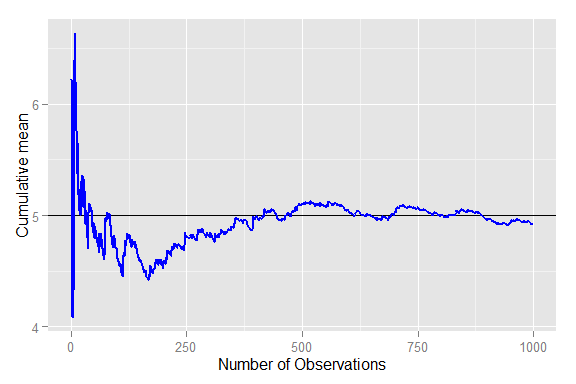
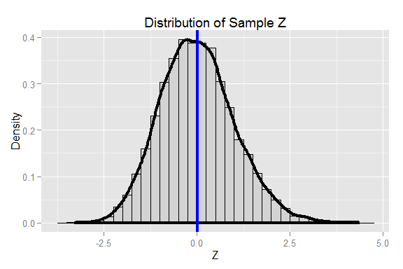

# Statistical Inference Project - Part 1

This project consists of two parts, simulation and basic inferential data analysis.

Part 1 is covered in this report. Part two will be covered in a separate report.
 
## Part 1

The intend of this report is to use simulation to investigate the distribution of averages of 40 exponentially distributed observations from a population with mean and standard deviation of $1/\lambda$, where lambda is 0.2. In this process we would like to answer 5 questions specified in steps 1-5. 

__*Step 1:*__
Illustrate via simulation and associated explanatory text the properties of the distribution of the mean of 40 exponentials.

According to CLT, $(\bar X - \mu) / (S /\sqrt n)$ ~ $t_{(1-\alpha/2),df}$ and as the sample mean increases it converges to N(0,1). As we increase the number of randomly selected samples (or increase sample size) the average of sample means (mean of large sample) approaches the population mean.    

We start with the cumulative mean of exponential r.v. to verify how fast it approaches the population mean, $\mu = 1/\lambda$ as the sample size increases?


```r
library(ggplot2)
set.seed(74337)
n <- 1000; lambda <- 0.2
means <- cumsum(rexp(n,lambda))/(1:n)
g <- ggplot(data.frame(x = 1:n, y = means), aes(x = x, y = y))
g <- g + geom_hline(yintercept = 1/lambda) + geom_line(size = 1, col="blue")
g <- g + labs(x = "Number of Observations", y = "Cumulative mean")
g
```

 

There are considerable deviation from theoretical mean for sample small size, even with sample size of  250 observations. As it reaches an equilibrium state this deviation should diminish. However, we might see the effect of the deviation when we are computing the confidence intervals for estimating the population mean.  

Next, we generate the matrix with 10000 samples of 40 observation each, and calculate the mean, sd, se, and Z for each sample. 


```r
nosim <- 10000; n <- 40
lambda <- 0.2; mu <- 1/lambda
set.seed(74337)
m <- matrix(rexp(nosim * n,lambda), nosim)
sMean <- apply(m, 1, mean)
sSD <- apply(m, 1, sd)
se <- sSD/sqrt(n)
sZ <- (sMean - mu)*sqrt(n)/mu
```

Summary of the stats calculated from the sample measurements are shown below: 
```
Sample Stats    |   Mean    |   SD    |
----------------|-----------|---------|
means           |   5.01    |   0.79  |
SD's            |   4.88    |   1.05  |    
SE's            |   0.77    |   0.17  |
Z's             |   0.01    |   1     |
```

Plots for sample means and Z are produce by the following ggplot.


```r
df <- as.data.frame(cbind(sMean,sZ,sSD,se))
ggplot(df, aes(x = sMean)) +
   geom_histogram(fill = "lightgrey", binwidth=.25, aes(y = ..density..), colour = "black") +
   geom_density(size = 1.5) + geom_vline(xintercept = mean(sMean), size = 1.5, col="blue") +
   labs(title="Distribution of Sample Means", x="Sample Means", y="Density")
```

 

__*Step 2:*__ 
Show where the distribution is centered at and compare it to the theoretical center of the distribution.

Distribution of samples means are centered around the theoretical mean, $1/\lambda$.
Average of samples' means is equal to the population mean, $\mu = 1/\lambda = 5$.
Also average of samples' standard deviations is nearing the population standard deviation, $\sigma = 1/\lambda = 5$. Therefore, the samples means and SD closely represent the population parameters and its distribution.


```r
ggplot(df, aes(x = sZ)) +
   geom_histogram(fill = "lightgrey", binwidth=.25, aes(y = ..density..), colour = "black") +
   geom_density(size = 1.5) + geom_vline(xintercept = mean(sZ), size = 1.5, col="blue") +
   labs(title="Distribution of Sample Z", x="Z", y="Density")
```

 

```r
paste("Xbar ~ t(",round(mean(sMean),2),",",round(sd(sMean),2)^2,")")
```

```
## [1] "Xbar ~ t( 5.01 , 0.6241 )"
```

```r
paste("Z ~ N(",round(mean(sZ),2),",",round(sd(sZ),2)^2,")")
```

```
## [1] "Z ~ N( 0.01 , 1 )"
```

__*Step 3:*__
Show that the distribution is approximately normal.

Distribution of samples Z are centered around the theoretical mean of standard normal. Average over all the sample Z values is close to the theoretical mean, $\mu = 0$. Same for the variance/SD of the Z, which is equal to the theoretical variance/SD of population, 1. 

It is clear that t(mean=5,SD=5) converges to the standard normal, N(0,1), as the number of samples increase. This and the symmetric bell shape of the density functions plotted in previous graphs prove that the distribution is approximately normal.

__*Step 4:*__
Show how variable it is and compare it to the theoretical variance of the distribution.

Standard error, se, is the measure of the variability of sample means obtained from repeated random samples of size n. Standard error for each sample was calculated in the second code chunk above. The graph below depicts the distribution and density with mean/variance of standard errors of all samples  0.77/0.17 to compare with the SE based on population SD, 0.79. The small SE results in small confidence interval, a factor to consider when working on the coverage of $1/\lambda$ C.I. 


```r
ggplot(df, aes(x = se)) +
    geom_histogram(fill = "lightgrey", binwidth=.05, aes(y = ..density..), colour = "black") +
    geom_density(size = 1.5) + geom_vline(xintercept = mean(se), size = 1.5, col="blue") + 
    labs(title="Distribution of Standard Error of sample means", x="Sample means' SE", y="Density")
```

 

__*Step 5:*__
Evaluate the coverage of the confidence interval for $1/\lambda: \bar X +__ 1.96S/\sqrt n$.

Because $\sigma$ is known, it is not reasonable to estimate $\sigma$ by the sample standard deviation S and to try to construct CIs using the quantity $(\bar X - \mu)/(S/sqrt n)$. The problem is
that this quantity is no longer normally distributed [Ref.: Bernard Rosner, Fundamentals of Biostatistics]. He goes on saying, the use of s for determining the CI for the mean of a normal distribution applies only if n > 200. For n < 200 S should be replaced with $\sigma$. 

We tried many different scenarios and found large percentage of the CI do not cover the population mean. Only with sample sizes of 200 and higher we could see a large percentage of the CIs (60%) include the population mean. There are multiple factors that could contribute to this. Because SE is very small in first place and gets smaller as n increases, and the fact that we are looking at 95% CI only, the only element of variation remains to be the sample mean. We touched on this at the beginning of the report that for small sample size the sample mean could deviate considerably. 

My interpretation of this problem, like many others, in this course, is to just find the CI using the given formula for the interval. 


```r
mean(sMean) + c(-1,1) + 1.96*sd(sMean)/sqrt(n)
```

```
## [1] 4.256 6.256
```

```r
mean(sMean) + c(-1,1) + qt(.975,39)*sd(sMean)/sqrt(n)
```

```
## [1] 4.264 6.264
```

Therefore, the CI coverage under Normal Distribution is:  (4.060147, 6.060147), which includes population mean, $\mu=5$.

Also trying t-distribution, the CI coverage under t is:    (4.061712, 6.061712), which also includes population mean, $\mu=5$.

