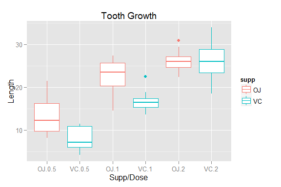

# Statistical Inference Project - Part 2
This project consists of two parts, simulation and basic inferential data analysis.

Part 2 is covered in this report. Part one will be covered in a separate report.

__*Introduction*__:

We intend to analyze the Tooth Growth data in the R data sets package.

Data Description: The response is the length of teeth in each of 10 guinea pigs 
at each of three dose levels of Vitamin C (0.5, 1, and 2 mg) with each of two delivery methods, orange juice (OJ) or ascorbic acid (VC).

Data set: A data frame with 60 observations on 3 variables.

    len     numeric     Tooth length  
    supp 	factor 	    Supplement type (VC or OJ)  
    dose 	numeric 	Dose in milligrams    

In this report we intend to answer 4 questions highlighted in Steps 1-4
. 
__*Step 1:*__

Load the Tooth Growth data and perform some basic exploratory data analyses. 


```r
library(plyr)
library(ggplot2)
data(ToothGrowth)
str(ToothGrowth)
```

```
## 'data.frame':	60 obs. of  3 variables:
##  $ len : num  4.2 11.5 7.3 5.8 6.4 10 11.2 11.2 5.2 7 ...
##  $ supp: Factor w/ 2 levels "OJ","VC": 2 2 2 2 2 2 2 2 2 2 ...
##  $ dose: num  0.5 0.5 0.5 0.5 0.5 0.5 0.5 0.5 0.5 0.5 ...
```

```r
sum(is.na(ToothGrowth))
```

```
## [1] 0
```
There are no NAs in the data and the data set is in the right format for computation and generating plots. 

__*Step 2:*__

Provide a basic summary of the data.

```r
TG <- ToothGrowth
group <- ddply(TG, c("supp","dose"), summarise, Mean=mean(len), SD=sd(len), Med=median(len))
group
```

```
##   supp dose  Mean    SD   Med
## 1   OJ  0.5 13.23 4.460 12.25
## 2   OJ  1.0 22.70 3.911 23.45
## 3   OJ  2.0 26.06 2.655 25.95
## 4   VC  0.5  7.98 2.747  7.15
## 5   VC  1.0 16.77 2.515 16.50
## 6   VC  2.0 26.14 4.798 25.95
```

```r
qplot(interaction(supp,dose), len, data=TG, geom="boxplot", xlab="Supp/Dose", ylab="Length", main = "Tooth Growth", color=supp)
```

 

Observations from the above measurements and boxplot:

* Effectiveness of each supplement increases as their dosage is increased. This can be observed for both VC and OJ supplements. 
* It is pretty clear that supplement type OJ is much more effective than supplement VC, at least for the first two dosages (0.5 and 1 milligrams).
* There is no significant difference between the supplements with 2 milligram dose, with equal median and mean.

__*Step 3:*__

Use confidence intervals and hypothesis tests to compare tooth growth by supp and dose. (Use the techniques from class even if there's other approaches worth considering)

Can we assume data are iid and paired? Probably not. Paired comparison procedures work best if the pairs are highly positively correlated. This is often arranged by making the components of each pair two measurements on the same individual (before and after, left and right, treatment and control, etc.). In our case, 10 guinea pigs are selected at random for each combination of supplement and dosage. We assume data are from a population with normal distribution and data in each group in each group are mutually independent.

We start with the hypothesis to verify if mean of VC and OJ are equal for 2 mg dose. 

Hypothesis Test (dose = 2 mg): Supplement OJ is as effective as supplement VC when 2 mg dosage is administered to the corresponding groups of subject under experiment (Guinea pigs).

$H_0: \mu_{OJ} - \mu_{VC} = 0$

$H_a: \mu_{OJ} - \mu_{VC} != 0$

We will run the test for cases where the variances are equal or not equal, since we don't have enough information to choose one over the other. 


```r
oj2 <- TG[TG$supp == "OJ" & TG$dose == 2,]
vc2 <- TG[TG$supp == "VC" & TG$dose == 2,]
rbind(
    t.test(oj2$len, vc2$len, paired = FALSE, var.equal = FALSE)$conf,
    t.test(oj2$len, vc2$len, paired = FALSE, var.equal = TRUE)$conf,
    t.test(oj2$len, vc2$len, paired = TRUE)$conf)
```

```
##        [,1]  [,2]
## [1,] -3.798 3.638
## [2,] -3.723 3.563
## [3,] -4.329 4.169
```

So, we accept the null hypothesis, that both VC and OJ are equally effective when 2 mg dose of the supplement are used in the experiment.

We continue with the same hypothesis testing for dosages of 1 mg and 0.5 mg, and check if contrary to what we see from the boxplot, the supplement are actually have the same effect on tooth growth. 

Hypothesis Test (dose 1 mg): Supplement OJ is as effective as supplement VC when 1 mg dosage is administered to the corresponding groups of subject under experiment (Guinea pigs).

$H_0: \mu_{OJ} - \mu_{VC} = 0$

$H_a: \mu_{OJ} - \mu_{VC} != 0$


```r
oj1 <- TG[TG$supp == "OJ" & TG$dose == 1,]
vc1 <- TG[TG$supp == "VC" & TG$dose == 1,]
rbind(
    t.test(oj1$len, vc1$len, paired = FALSE, var.equal = FALSE)$conf,
    t.test(oj1$len, vc1$len, paired = FALSE, var.equal = TRUE)$conf,
    t.test(oj1$len, vc1$len, paired = TRUE)$conf)
```

```
##       [,1]  [,2]
## [1,] 2.802 9.058
## [2,] 2.841 9.019
## [3,] 1.952 9.908
```
Hypothesis Test (dose = 0.5 mg): Supplement OJ is as effective as supplement VC when 0.5 mg dosage is administered to the corresponding groups of subject under experiment (Guinea pigs).

$H_0: \mu_{OJ} - \mu_{VC} = 0$

$H_a: \mu_{OJ} - \mu_{VC} != 0$


```r
oj0.5 <- TG[TG$supp == "OJ" & TG$dose == 0.5,]
vc0.5 <- TG[TG$supp == "VC" & TG$dose == 0.5,]
rbind(
    t.test(oj0.5$len, vc0.5$len, paired = FALSE, var.equal = FALSE)$conf,
    t.test(oj0.5$len, vc0.5$len, paired = FALSE, var.equal = TRUE)$conf,
    t.test(oj0.5$len, vc0.5$len, paired = TRUE)$conf)
```

```
##       [,1]  [,2]
## [1,] 1.719 8.781
## [2,] 1.770 8.730
## [3,] 1.263 9.237
```

In both cases (dose of 1 and 0.5 mg) we reject $H_0$ in favor of $H_a$, indicating that at lower dosage of the two supplements we should expect a different results. Furthermore, because the $\mu$ falls out side in the lower part of CI we can conclude that supplement OJ more effective than VC.  

__*Step 4*__

State your conclusions and the assumptions needed for your conclusions. 

Based on the information available in ToothGrowth data set we had to make the  assumptions:
1. The data used in the experiment are independent and there is no correlation across the groups.
2. Sample size of 10 is not large enough (>30) to use normal distribution, so we resorted to using to t-distribution instead. 
3. Since there is no information on population standard deviation, we calculated the CI for both cases of equal variance and different variance.

In conclusion, OJ is more effective than VC for lower dosages of the supplement administered to the Guinea pigs and equally as effective as VC when a 2 mg dosage are given to the Guinea pigs.
